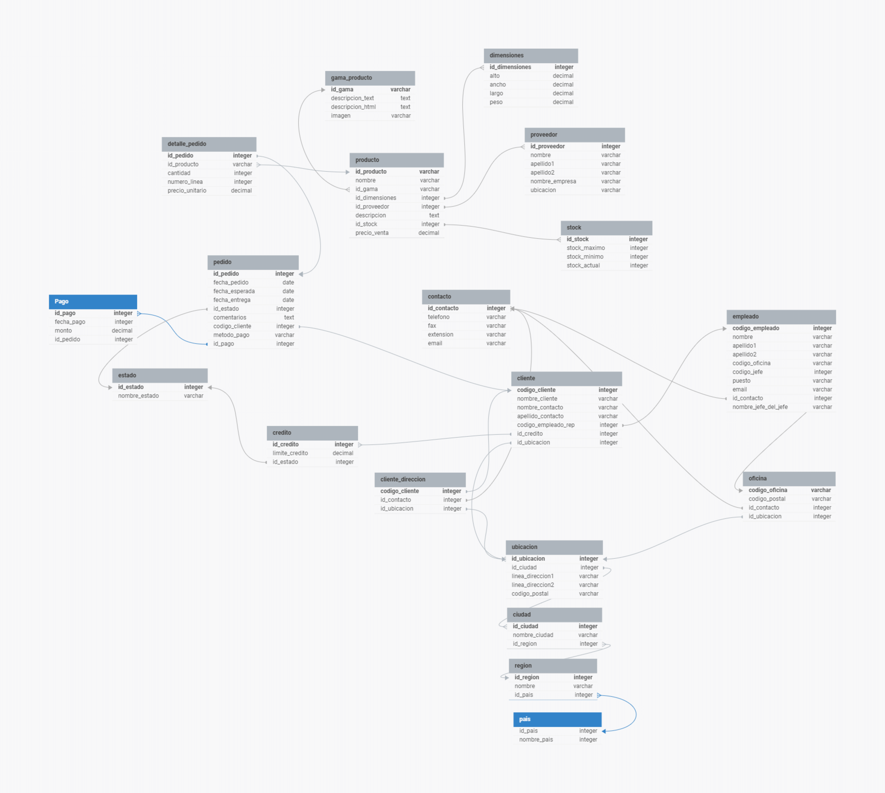

# Taller Nr 3



#### **Consultas sobre una tabla**

1. Devuelve un listado con el código de oficina y la ciudad donde hay oficinas.

   ```sql
   SELECT o.codigo_oficina, c.nombre_ciudad
   FROM oficina o
   JOIN ubicacion u ON o.id_ubicacion = u.id_ubicacion
   JOIN ciudad c ON u.id_ciudad = c.id_ciudad;
   +----------------+---------------+
   | codigo_oficina | nombre_ciudad |
   +----------------+---------------+
   | OF1            | Fuenlabrada   |
   | OF2            | París         |
   | OF3            | Madrid        |
   +----------------+---------------+
   ```
   
   
   
2. Devuelve un listado con la ciudad y el teléfono de las oficinas de España.

   ```sql
   SELECT c.nombre_ciudad, co.telefono
   FROM oficina AS o
   JOIN ubicacion AS u ON o.id_ubicacion = u.id_ubicacion
   JOIN ciudad As c ON u.id_ciudad = c.id_ciudad
   JOIN pais AS p ON c.id_region = p.id_pais
   JOIN contacto AS co ON o.id_contacto = co.id_contacto
   WHERE p.nombre_pais = 'España';
   +---------------+-----------------+
   | nombre_ciudad | telefono        |
   +---------------+-----------------+
   | Fuenlabrada   | +34 123 456 789 |
   +---------------+-----------------+
   ```

   

3. Devuelve un listado con el nombre, apellidos y email de los empleados cuyo
    jefe tiene un código de jefe igual a 7.

  ```sql
  SELECT nombre, apellido1, apellido2, email
  FROM empleado
  WHERE codigo_jefe = 7;
  +--------+-----------+-----------+--------------------------+
  | nombre | apellido1 | apellido2 | email                    |
  +--------+-----------+-----------+--------------------------+
  | Juan   | Perez     | Mantila   | JuanMantilla@empresa.com |
  +--------+-----------+-----------+--------------------------+
  ```

  

4. Devuelve el nombre del puesto, nombre, apellidos y email del jefe de la
    empresa.

5. Devuelve un listado con el nombre, apellidos y puesto de aquellos
    empleados que no sean representantes de ventas.

  ```sql
  SELECT nombre, apellido1, apellido2, puesto
  FROM empleado
  WHERE puesto <> 'Representante de Ventas';
  +--------+-----------+-----------+--------------------------+
  | nombre | apellido1 | apellido2 | puesto                   |
  +--------+-----------+-----------+--------------------------+
  | Juan   | Perez     | Mantila   | Gerente                  |
  | María  | González  | Martínez  | Asistente Administrativo |
  +--------+-----------+-----------+--------------------------+
  ```

  

6. Devuelve un listado con el nombre de los todos los clientes españoles.

     ```sql
     SELECT cl.nombre_cliente
     FROM cliente cl
     JOIN ubicacion u ON cl.id_ubicacion = u.id_ubicacion
     JOIN ciudad ci ON u.id_ciudad = ci.id_ciudad
     JOIN region r ON ci.id_region = r.id_region
     JOIN pais p ON r.id_pais = p.id_pais
     WHERE p.nombre_pais = 'España';
     +----------------+
     | nombre_cliente |
     +----------------+
     | Pedro          |
     | Juan Jose      |
     +----------------+
     ```

     

7. Devuelve un listado con los distintos estados por los que puede pasar un
     pedido.

     ```sql
     SELECT  nombre_estado 
     FROM estado;
     +---------------+
     | nombre_estado |
     +---------------+
     | En proceso    |
     | Finalizado    |
     | Negado        |
     +---------------+
     ```

     

8. Devuelve un listado con el código de cliente de aquellos clientes que
     realizaron algún pago en 2008. Tenga en cuenta que deberá eliminar
       aquellos códigos de cliente que aparezcan repetidos. Resuelva la consulta:
       • Utilizando la función YEAR de MySQL.

     ```sql
     SELECT DISTINCT codigo_cliente
     FROM pedido
     WHERE YEAR(fecha_pedido) = 2008;
     
     +----------------+
     | codigo_cliente |
     +----------------+
     |              1 |
     |              3 |
     |              2 |
     +----------------+
     ```
     
       • Utilizando la función DATE_FORMAT de MySQL.
     
     ```sql
     SELECT DISTINCT codigo_cliente
     FROM pedido
     WHERE DATE_FORMAT(fecha_pedido, '%Y') = '2008';
     +----------------+
     | codigo_cliente |
     +----------------+
     |              1 |
     |              3 |
     |              2 |
     +----------------+
     ```

       • Sin utilizar ninguna de las funciones anteriores.
     
     ```sql
     SELECT DISTINCT codigo_cliente
     FROM pedido
     WHERE fecha_pedido >= '2008-01-01' AND fecha_pedido < '2009-01-01';
     +----------------+
     | codigo_cliente |
     +----------------+
     |              1 |
     |              3 |
     |              2 |
     +----------------+
     ```
     
     
     
9. Devuelve un listado con el código de pedido, código de cliente, fecha
     esperada y fecha de entrega de los pedidos que no han sido entregados a
       tiempo.

     ```sql
     SELECT id_pedido, codigo_cliente, fecha_esperada, fecha_entrega
     FROM pedido
     WHERE fecha_entrega > fecha_esperada;
     +-----------+----------------+----------------+---------------+
     | id_pedido | codigo_cliente | fecha_esperada | fecha_entrega |
     +-----------+----------------+----------------+---------------+
     |         3 |              3 | 2024-01-23     | 2024-04-20    |
     |         5 |              1 | 2010-04-25     | 2010-04-26    |
     |         6 |              2 | 2008-07-01     | 2008-07-02    |
     |         7 |              1 | 2010-04-25     | 2010-04-27    |
     |         8 |              3 | 2008-08-05     | 2008-08-06    |
     |         9 |              1 | 2010-04-25     | 2010-04-28    |
     +-----------+----------------+----------------+---------------+
     ```
     
     
     
10. Devuelve un listado con el código de pedido, código de cliente, fecha
     esperada y fecha de entrega de los pedidos cuya fecha de entrega ha sido al
     menos dos días antes de la fecha esperada.
     • Utilizando la función ADDDATE de MySQL.

     ```sql
     SELECT id_pedido, codigo_cliente, fecha_esperada, fecha_entrega
     FROM pedido
     WHERE fecha_entrega <= ADDDATE(fecha_esperada, -2);
     +-----------+----------------+----------------+---------------+
     | id_pedido | codigo_cliente | fecha_esperada | fecha_entrega |
     +-----------+----------------+----------------+---------------+
     |        11 |              2 | 2024-04-20     | 2024-04-18    |
     +-----------+----------------+----------------+---------------+
     ```

     • Utilizando la función DATEDIFF de MySQL.

     ```sql
     SELECT id_pedido, codigo_cliente, fecha_esperada, fecha_entrega
     FROM pedido
     WHERE DATEDIFF(fecha_esperada, fecha_entrega) >= 2;
     +-----------+----------------+----------------+---------------+
     | id_pedido | codigo_cliente | fecha_esperada | fecha_entrega |
     +-----------+----------------+----------------+---------------+
     |        11 |              2 | 2024-04-20     | 2024-04-18    |
     +-----------+----------------+----------------+---------------+
     ```

     • ¿Sería posible resolver esta consulta utilizando el operador de suma + o
     resta -?

     *No es posible resolver esta consulta utilizando directamente el operador de suma (+) o resta (-) en la comparación de fechas, ya que MySQL requiere una función específica (como `DATEDIFF`) para calcular la diferencia entre fechas.*

     

     

11. Devuelve un listado de todos los pedidos que fueron rechazados en 2009.

      ```sql
      SELECT id_pedido, fecha_pedido, fecha_esperada, fecha_entrega, id_estado, comentarios, codigo_cliente
      FROM pedido
      WHERE id_estado = (
          SELECT id_estado FROM estado WHERE nombre_estado = 'Negado'
      ) AND YEAR(fecha_pedido) = 2009;
      
      +-----------+--------------+----------------+---------------+-----------+-------------+----------------+
      | id_pedido | fecha_pedido | fecha_esperada | fecha_entrega | id_estado | comentarios | codigo_cliente |
      +-----------+--------------+----------------+---------------+-----------+-------------+----------------+
      |         2 | 2009-04-18   | 2009-04-24     | 2009-04-24    |        10 | Coment 2    |              2 |
      +-----------+--------------+----------------+---------------+-----------+-------------+----------------+
      ```
    
      
    
12. Devuelve un listado de todos los pedidos que han sido entregados en el
      mes de enero de cualquier año.

      ```sql
      SELECT id_pedido, fecha_pedido, fecha_esperada, fecha_entrega, id_estado, comentarios, codigo_cliente
      FROM pedido
      WHERE MONTH(fecha_entrega) = 1;
      +-----------+--------------+----------------+---------------+-----------+-------------+----------------+
      | id_pedido | fecha_pedido | fecha_esperada | fecha_entrega | id_estado | comentarios | codigo_cliente |
      +-----------+--------------+----------------+---------------+-----------+-------------+----------------+
      |         1 | 2008-04-19   | 2024-01-25     | 2024-01-25    |         1 | Coment 1    |              1 |
      +-----------+--------------+----------------+---------------+-----------+-------------+----------------+
      ```

      

13. Devuelve un listado con todos los pagos que se realizaron en el
      año 2008 mediante Paypal. Ordene el resultado de mayor a menor.

      ```sql
      SELECT id_pedido AS id, fecha_pedido, fecha_esperada, fecha_entrega, id_estado, comentarios, codigo_cliente, metodo_pago As met
      FROM pedido
      WHERE YEAR(fecha_pago) = 2008
      AND metodo_pago = 'Paypal'
      ORDER BY id_pedido DESC;
      
      +----+--------------+----------------+---------------+-----------+--------------+----------------+--------+
      | id | fecha_pedido | fecha_esperada | fecha_entrega | id_estado | comentarios  | codigo_cliente | met    |
      +----+--------------+----------------+---------------+-----------+--------------+----------------+--------+
      |  8 | 2008-07-20   | 2008-08-05     | 2008-08-06    |         1 | Comentario 8 |              3 | Paypal |
      |  6 | 2008-06-15   | 2008-07-01     | 2008-07-02    |         1 | Comentario 6 |              2 | Paypal |
      +----+--------------+----------------+---------------+-----------+--------------+----------------+--------+
      ```
    
      
    
14. Devuelve un listado con todas las formas de pago que aparecen en la
      tabla pago. Tenga en cuenta que no deben aparecer formas de pago
      repetidas.

      ```sql
      SELECT DISTINCT metodo_pago
      FROM pedido;
      +------------------------+
      | metodo_pago            |
      +------------------------+
      | Tarjeta de crédito     |
      | Cheque                 |
      | Transferencia bancaria |
      | Paypal                 |
      | Efectivo               |
      +------------------------+
      ```
    
      
    
15. Devuelve un listado con todos los productos que pertenecen a la gama Ornamentales y que tienen más de 100 unidades en stock. El listado deberá estar ordenado por su precio de venta, mostrando en primer lugar los de mayor precio.

      ```sql
      SELECT p.id_producto AS id, p.nombre, p.id_gama AS gama, p.id_dimensiones AS dimensiones, p.id_proveedor AS proveedor, p.descripcion, p.id_stock, p.precio_venta
      FROM producto p
      JOIN gama_producto g ON p.id_gama = g.id_gama
      JOIN stock s ON p.id_stock = s.id_stock
      WHERE g.descripcion_text = 'Productos ornamentales para decoración.' AND s.stock_actual > 100
      ORDER BY p.precio_venta DESC;
      
      +-------+--------------------+--------------+-------------+-----------+--------------------------------+----------+--------------+
      | id    | nombre             | gama         | dimensiones | proveedor | descripcion                    | id_stock | precio_venta |
      +-------+--------------------+--------------+-------------+-----------+--------------------------------+----------+--------------+
      | PROD4 | Florero Ornamental | Ornamentales |           4 |         4 | Florero ornamental de cristal. |        1 |        29.99 |
      | PROD1 | Planta Ornamental  | Ornamentales |           1 |         1 | Planta ornamental de interior. |        1 |        15.99 |
      +-------+--------------------+--------------+-------------+-----------+--------------------------------+----------+--------------+
      ```
    
      
    
16. Devuelve un listado con todos los clientes que sean de la ciudad de Madrid y
      cuyo representante de ventas tenga el código de empleado 11 o 30.

      ```sql
      SELECT c.codigo_cliente, c.nombre_cliente, c.nombre_contacto, c.apellido_contacto, c.codigo_empleado_rep, c.id_credito, c.id_ubicacion
      FROM cliente c
      JOIN cliente_direccion cd ON c.codigo_cliente = cd.codigo_cliente
      JOIN ubicacion u ON cd.id_ubicacion = u.id_ubicacion
      JOIN ciudad ci ON u.id_ciudad = ci.id_ciudad
      WHERE ci.nombre_ciudad = 'Madrid'
      AND c.codigo_empleado_rep IN (11, 30);
      
      
      +----------------+----------------+-----------------+-------------------+---------------------+------------+--------------+
      | codigo_cliente | nombre_cliente | nombre_contacto | apellido_contacto | codigo_empleado_rep | id_credito | id_ubicacion |
      +----------------+----------------+-----------------+-------------------+---------------------+------------+--------------+
      |              3 | Cliente 3      | Contacto 3      | Apellido 3        |                  30 |          3 |            3 |
      +----------------+----------------+-----------------+-------------------+---------------------+------------+--------------+
      ```
    
      

#### Consultas multitabla (Composición interna)

*Resuelva todas las consultas utilizando la sintaxis de SQL1 y SQL2. Las consultas con*
*sintaxis de SQL2 se deben resolver con INNER JOIN y NATURAL JOIN.*

1. Obtén un listado con el nombre de cada cliente y el nombre y apellido de su
    representante de ventas.
    
    ```sql
    SELECT c.nombre_cliente, e.nombre, e.apellido1
    FROM cliente c
    JOIN empleado e ON c.codigo_empleado_rep = e.codigo_empleado;
    
    
    +----------------+---------+-----------+
    | nombre_cliente | nombre  | apellido1 |
    +----------------+---------+-----------+
    | Martha         | Juan    | Perez     |
    | Juan Jose      | Antonia | Juarez    |
    +----------------+---------+-----------+
    ```
    
2. Muestra el nombre de los clientes que hayan realizado pagos junto con el
    nombre de sus representantes de ventas.
    
    ```sql
    SELECT DISTINCT c.nombre_cliente, e.nombre, e.apellido1
    FROM cliente c
    JOIN pedido p ON c.codigo_cliente = p.codigo_cliente
    JOIN empleado e ON c.codigo_empleado_rep = e.codigo_empleado
    WHERE p.id_estado = 1; 
    
    +----------------+--------+-----------+
    | nombre_cliente | nombre | apellido1 |
    +----------------+--------+-----------+
    | Martha         | Juan   | Perez     |
    +----------------+--------+-----------+
    ```
    
3. Muestra el nombre de los clientes que no hayan realizado pagos junto con
    el nombre de sus representantes de ventas.
    
    ```sql
    SELECT c.nombre_cliente, c.nombre_contacto, c.apellido_contacto, e.nombre AS nombre_representante
    FROM cliente c
    LEFT JOIN pedido p ON c.codigo_cliente = p.codigo_cliente
    LEFT JOIN empleado e ON c.codigo_empleado_rep = e.codigo_empleado
    WHERE p.id_pedido IS NULL;
    
    +----------------+-----------------+-------------------+----------------------+
    | nombre_cliente | nombre_contacto | apellido_contacto | nombre_representante |
    +----------------+-----------------+-------------------+----------------------+
    | Juan Jose      | Contacto        | Basto             | Antonia              |
    +----------------+-----------------+-------------------+----------------------+
    ```
    
4. Devuelve el nombre de los clientes que han hecho pagos y el nombre de sus
    representantes junto con la ciudad de la oficina a la que pertenece el
    representante.

  ```sql
  SELECT c.nombre_cliente, e.nombre, e.apellido1, ci.nombre_ciudad
  FROM cliente c
  JOIN pedido p ON c.codigo_cliente = p.codigo_cliente
  JOIN empleado e ON c.codigo_empleado_rep = e.codigo_empleado
  JOIN oficina o ON e.codigo_oficina = o.codigo_oficina
  JOIN ubicacion u ON o.id_ubicacion = u.id_ubicacion
  JOIN ciudad ci ON u.id_ciudad = ci.id_ciudad;
  
  +----------------+--------+-----------+---------------+
  | nombre_cliente | nombre | apellido1 | nombre_ciudad |
  +----------------+--------+-----------+---------------+
  | Martha         | Juan   | Perez     | París         |
  | Martha         | Juan   | Perez     | París         |
  +----------------+--------+-----------+---------------+
  ```


5. Devuelve el nombre de los clientes que no hayan hecho pagos y el nombre
    de sus representantes junto con la ciudad de la oficina a la que pertenece el
    representante.

  ```sql
  SELECT c.nombre_cliente, e.nombre AS nombre_representante, ci.nombre_ciudad AS ciudad_oficina
  FROM cliente c
  LEFT JOIN empleado e ON c.codigo_empleado_rep = e.codigo_empleado
  LEFT JOIN oficina o ON e.codigo_oficina = o.codigo_oficina
  LEFT JOIN ciudad ci ON o.id_ubicacion = ci.id_ciudad
  WHERE c.codigo_cliente NOT IN (SELECT DISTINCT codigo_cliente FROM pedido);
  
  +----------------+----------------------+----------------+
  | nombre_cliente | nombre_representante | ciudad_oficina |
  +----------------+----------------------+----------------+
  | Juan Jose      | Antonia              | Fuenlabrada    |
  +----------------+----------------------+----------------+
  ```


6. Lista la dirección de las oficinas que tengan clientes en Fuenlabrada.

     ```sql
     SELECT u.linea_direccion1, u.linea_direccion2, u.codigo_postal
     FROM cliente c
     JOIN empleado e ON c.codigo_empleado_rep = e.codigo_empleado
     JOIN oficina o ON e.codigo_oficina = o.codigo_oficina
     JOIN ubicacion u ON o.id_ubicacion = u.id_ubicacion
     JOIN ciudad ci ON u.id_ciudad = ci.id_ciudad
     WHERE ci.nombre_ciudad = 'Fuenlabrada';
     
     +---------------------+------------------+---------------+
     | linea_direccion1    | linea_direccion2 | codigo_postal |
     +---------------------+------------------+---------------+
     | Calle Principal 123 | Edificio A       | 41001         |
     +---------------------+------------------+---------------+
     ```

7. Devuelve el nombre de los clientes y el nombre de sus representantes junto
    con la ciudad de la oficina a la que pertenece el representante.

    ```sql
    SELECT c.nombre_cliente AS nombre, e.nombre AS nombre_rep, ci.nombre_ciudad AS ciudad
    FROM  cliente c
    JOIN empleado e ON c.codigo_empleado_rep = e.codigo_empleado
    JOIN oficina o ON e.codigo_oficina = o.codigo_oficina
    JOIN ubicacion u ON o.id_ubicacion = u.id_ubicacion
    JOIN ciudad ci ON u.id_ciudad = ci.id_ciudad;
    
    +-----------+------------+-------------+
    | nombre    | nombre_rep | ciudad      |
    +-----------+------------+-------------+
    | Martha    | Juan       | París       |
    | Juan Jose | Antonia    | Fuenlabrada |
    +-----------+------------+-------------+
    ```

    

8. Devuelve un listado con el nombre de los empleados junto con el nombre
    de sus jefes.

    ```sql
    UPDATE empleado 
    SET codigo_jefe = 2 
    WHERE codigo_empleado = 1;
    
    UPDATE empleado 
    SET codigo_jefe = 3 
    WHERE codigo_empleado = 2;
    
    SELECT  e1.nombre AS nombre_empleado, e2.nombre AS nombre_jefe
    FROM empleado AS e1
    LEFT JOIN empleado AS e2 ON e1.codigo_jefe = e2.codigo_empleado;
    +-----------------+-------------+
    | nombre_empleado | nombre_jefe |
    +-----------------+-------------+
    | Antonia         | Juan        |
    | Juan            | María       |
    | María           | Antonia     |
    +-----------------+-------------+
    ```

    

9. Devuelve un listado que muestre el nombre de cada empleados, el nombre
    de su jefe y el nombre del jefe de sus jefe.

    ```sql
    UPDATE empleado 
    SET codigo_jefe = 2 
    WHERE codigo_empleado = 1;
    
    UPDATE empleado 
    SET codigo_jefe = 3 
    WHERE codigo_empleado = 2;
    
    SELECT e1.nombre AS nombre_empleado, e2.nombre AS nombre_jefe, e3.nombre AS nombre_jefe_del_jefe
    FROM  empleado AS e1
    LEFT JOIN  empleado AS e2 ON e1.codigo_jefe = e2.codigo_empleado
    LEFT JOIN empleado AS e3 ON e2.codigo_jefe = e3.codigo_empleado;
    
    +-----------------+-------------+----------------------+
    | nombre_empleado | nombre_jefe | nombre_jefe_del_jefe |
    +-----------------+-------------+----------------------+
    | Antonia         | Juan        | María                |
    | Juan            | María       | Antonia              |
    | María           | Antonia     | Juan                 |
    +-----------------+-------------+----------------------+
    ```

    

10. Devuelve el nombre de los clientes a los que no se les ha entregado a
    tiempo un pedido.

    ```sql
    SELECT DISTINCT c.nombre_cliente
    FROM cliente c
    JOIN pedido p ON c.codigo_cliente = p.codigo_cliente
    WHERE p.fecha_entrega > p.fecha_esperada;
    
    +----------------+
    | nombre_cliente |
    +----------------+
    | Cliente 3      |
    | Pedro          |
    | Martha         |
    +----------------+
    ```

    

11. Devuelve un listado de las diferentes gamas de producto que ha comprado
     cada cliente.

     ```sql
     SELECT c.nombre_cliente, GROUP_CONCAT(DISTINCT gp.descripcion_text SEPARATOR ', ') AS gamas_productos_compradas
     FROM  cliente AS c
     JOIN  pedido p ON c.codigo_cliente = p.codigo_cliente
     JOIN detalle_pedido dp ON p.id_pedido = dp.id_pedido
     JOIN producto AS prod ON dp.id_producto = prod.id_producto
     JOIN gama_producto AS gp ON prod.id_gama = gp.id_gama
     GROUP BY c.nombre_cliente;
     
     
     +----------------+------------------------------------------+
     | nombre_cliente | gamas_productos_compradas                |
     +----------------+------------------------------------------+
     | Cliente 3      | Electrodomésticos para el hogar.         |
     | Martha         | Productos frutales frescos y deliciosos. |
     | Pedro          | Productos ornamentales para decoración.  |
     +----------------+------------------------------------------+
     ```

     


#### Consultas multitabla (Composición externa)

*Resuelva todas las consultas utilizando las cláusulas LEFT JOIN, RIGHT JOIN, NATURAL*
*LEFT JOIN y NATURAL RIGHT JOIN.*

1. Devuelve un listado que muestre solamente los clientes que no han
    realizado ningún pago.

  ```sql
  SELECT c.nombre_cliente
  FROM cliente c
  LEFT JOIN pedido p ON c.codigo_cliente = p.codigo_cliente
  WHERE p.id_pedido IS NULL;
  
  +----------------+
  | nombre_cliente |
  +----------------+
  | Juan Jose      |
  +----------------+
  ```


2. Devuelve un listado que muestre solamente los clientes que no han
    realizado ningún pedido.

  ```sql
  SELECT c.nombre_cliente
  FROM cliente c
  LEFT JOIN pedido p ON c.codigo_cliente = p.codigo_cliente
  WHERE p.id_pedido IS NULL;
  
  +----------------+
  | nombre_cliente |
  +----------------+
  | Juan Jose      |
  +----------------+
  ```


3. Devuelve un listado que muestre los clientes que no han realizado ningún
    pago y los que no han realizado ningún pedido.

  ```sql
  SELECT nombre_cliente
  FROM cliente
  WHERE codigo_cliente NOT IN (
      SELECT DISTINCT codigo_cliente
      FROM pedido
  )
  
  UNION
  
  
  SELECT nombre_cliente
  FROM cliente
  WHERE codigo_cliente NOT IN (
      SELECT DISTINCT codigo_cliente
      FROM pedido
  );
  
  +----------------+
  | nombre_cliente |
  +----------------+
  | Juan Jose      |
  +----------------+
  ```


4. Devuelve un listado que muestre solamente los empleados que no tienen
    una oficina asociada.

  ```sql
  SELECT codigo_empleado, nombre, apellido1, apellido2, codigo_oficina, codigo_jefe, puesto, email, id_contacto, nombre_jefe_del_jefe
  FROM empleado;
  
  +-----------------+---------+-----------+-----------+----------------+-------------+--------------------------+--------------------------+-------------+----------------------+
  | codigo_empleado | nombre  | apellido1 | apellido2 | codigo_oficina | codigo_jefe | puesto                   | email                    | id_contacto | nombre_jefe_del_jefe |
  +-----------------+---------+-----------+-----------+----------------+-------------+--------------------------+--------------------------+-------------+----------------------+
  |               1 | Antonia | Juarez    | NULL      | OF1            |        NULL | Representante de Ventas  | empleado1@empresa.com    |           1 | 2                    |
  |               2 | Juan    | Perez     | Mantila   | OF2            |           7 | Gerente                  | JuanMantilla@empresa.com |           2 | 3                    |
  |               3 | María   | González  | Martínez  | OF3            |           1 | Asistente Administrativo | empleado3@empresa.com    |           3 | NULL                 |
  +-----------------+---------+-----------+-----------+----------------+-------------+--------------------------+--------------------------+-------------+----------------------+
  ```


5. Devuelve un listado que muestre solamente los empleados que no tienen un
    cliente asociado.

  ```sql
  SELECT codigo_empleado, nombre, apellido1, apellido2, codigo_oficina, codigo_jefe, puesto, email, id_contacto, nombre_jefe_del_jefe
  FROM empleado
  WHERE codigo_empleado NOT IN (SELECT DISTINCT codigo_empleado_rep FROM cliente);
  
  3|María|González|Martínez|OF3|1|Asistente Administrativo|empleado3@empresa.com|3|
  ```


6. Devuelve un listado que muestre solamente los empleados que no tienen un
    cliente asociado junto con los datos de la oficina donde trabajan.

  ```sql
  +-----------------+--------+-----------+-----------+----------------+-------------+--------------------------+-----------------------+-------------+----------------------+----------------+---------------+-------------+--------------+
  | codigo_empleado | nombre | apellido1 | apellido2 | codigo_oficina | codigo_jefe | puesto                   | email                 | id_contacto | nombre_jefe_del_jefe | codigo_oficina | codigo_postal | id_contacto | id_ubicacion |
  +-----------------+--------+-----------+-----------+----------------+-------------+--------------------------+-----------------------+-------------+----------------------+----------------+---------------+-------------+--------------+
  |               3 | María  | González  | Martínez  | OF3            |           1 | Asistente Administrativo | empleado3@empresa.com |           3 | NULL                 | OF3            | 80331         |           3 |            3 |
  +-----------------+--------+-----------+-----------+----------------+-------------+--------------------------+-----------------------+-------------+----------------------+----------------+---------------+-------------+--------------+
  ```


7. Devuelve un listado que muestre los empleados que no tienen una oficina
    asociada y los que no tienen un cliente asociado.

  ```sql
  SELECT e.codigo_empleado, e.nombre, e.apellido1, e.apellido2, e.codigo_oficina, e.codigo_jefe, e.puesto, e.email, e.id_contacto, e.nombre_jefe_del_jefe
  FROM empleado e
  LEFT JOIN oficina o ON e.codigo_oficina = o.codigo_oficina
  WHERE e.codigo_oficina IS NULL OR e.codigo_empleado NOT IN (SELECT DISTINCT codigo_empleado_rep FROM cliente);
  
  +-----------------+--------+-----------+-----------+----------------+-------------+--------------------------+-----------------------+-------------+----------------------+
  | codigo_empleado | nombre | apellido1 | apellido2 | codigo_oficina | codigo_jefe | puesto                   | email                 | id_contacto | nombre_jefe_del_jefe |
  +-----------------+--------+-----------+-----------+----------------+-------------+--------------------------+-----------------------+-------------+----------------------+
  |               3 | María  | González  | Martínez  | OF3            |           1 | Asistente Administrativo | empleado3@empresa.com |           3 | NULL                 |
  +-----------------+--------+-----------+-----------+----------------+-------------+--------------------------+-----------------------+-------------+----------------------+
  ```


8. Devuelve un listado de los productos que nunca han aparecido en un
    pedido.

  ```sql
  SELECT id_producto, nombre
  FROM producto
  WHERE id_producto NOT IN (
      SELECT DISTINCT id_producto
      FROM detalle_pedido
  );
  +-------------+--------------------+
  | id_producto | nombre             |
  +-------------+--------------------+
  | PROD4       | Florero Ornamental |
  +-------------+--------------------+
  ```


9. Devuelve un listado de los productos que nunca han aparecido en un
    pedido. El resultado debe mostrar el nombre, la descripción y la imagen del
    producto.

  ```sql
  SELECT p.nombre, p.descripcion, gp.imagen
  FROM producto AS p
  LEFT JOIN detalle_pedido AS dp ON p.id_producto = dp.id_producto
  LEFT JOIN gama_producto AS gp ON p.id_gama = gp.id_gama
  WHERE dp.id_producto IS NULL;
  
  
  +--------------------+--------------------------------+------------------+
  | nombre             | descripcion                    | imagen           |
  +--------------------+--------------------------------+------------------+
  | Florero Ornamental | Florero ornamental de cristal. | ornamentales.jpg |
  +--------------------+--------------------------------+------------------+
  ```

  

10. Devuelve las oficinas donde no trabajan ninguno de los empleados que
    hayan sido los representantes de ventas de algún cliente que haya realizado
    la compra de algún producto de la gama Frutales.

    ```sql
    SELECT o.codigo_oficina, o.codigo_postal, o.id_contacto, o.id_ubicacion
    FROM oficina o
    WHERE o.codigo_oficina NOT IN (
        SELECT e.codigo_oficina
        FROM empleado e
        WHERE e.codigo_empleado IN (
            SELECT c.codigo_empleado_rep
            FROM cliente c
            JOIN pedido p ON c.codigo_cliente = p.codigo_cliente
            JOIN detalle_pedido dp ON p.id_pedido = dp.id_pedido
            JOIN producto pr ON dp.id_producto = pr.id_producto
            JOIN gama_producto gp ON pr.id_gama = gp.id_gama
            WHERE gp.descripcion_text = 'Frutales'
        )
    );
    
    +----------------+---------------+-------------+--------------+
    | codigo_oficina | codigo_postal | id_contacto | id_ubicacion |
    +----------------+---------------+-------------+--------------+
    | OF1            | 41001         |           1 |            1 |
    | OF2            | 75008         |           2 |            2 |
    | OF3            | 80331         |           3 |            3 |
    +----------------+---------------+-------------+--------------+
    ```

11. Devuelve un listado con los clientes que han realizado algún pedido pero no
    han realizado ningún pago.

    ```sql
    SELECT DISTINCT c.codigo_cliente, c.nombre_cliente, c.nombre_contacto, c.apellido_contacto, c.codigo_empleado_rep, c.id_credito, c.id_ubicacion
    FROM cliente c
    JOIN pedido p ON c.codigo_cliente = p.codigo_cliente
    LEFT JOIN pago pg ON p.id_pedido = pg.id_pedido
    WHERE pg.id_pago IS NULL;
    +----------------+----------------+-----------------+-------------------+---------------------+------------+--------------+
    | codigo_cliente | nombre_cliente | nombre_contacto | apellido_contacto | codigo_empleado_rep | id_credito | id_ubicacion |
    +----------------+----------------+-----------------+-------------------+---------------------+------------+--------------+
    |              2 | Martha         | Contacto 2      | Santos 2          |                   2 |          2 |            2 |
    |              3 | Cliente 3      | Contacto 3      | Apellido 3        |                  30 |          3 |            3 |
    +----------------+----------------+-----------------+-------------------+---------------------+------------+--------------+
    ```

12. Devuelve un listado con los datos de los empleados que no tienen clientes
    asociados y el nombre de su jefe asociado.

    ```sql
    SELECT e.codigo_empleado, e.nombre, e.apellido2, e.codigo_oficina, e.codigo_jefe,
     e.puesto, e.email, e.id_contacto, e.nombre_jefe_del_jefe AS nombre_jefe
    FROM empleado AS e
    LEFT JOIN  cliente AS c ON e.codigo_empleado = c.codigo_empleado_rep
    LEFT JOIN  empleado AS ej ON e.codigo_jefe = ej.codigo_empleado
    WHERE c.codigo_cliente IS NULL;
    
    +-----------------+--------+-----------+-----------+----------------+-------------+--------------------------+-----------------------+-------------+-------------+
    | codigo_empleado | nombre | apellido1 | apellido2 | codigo_oficina | codigo_jefe | puesto                   | email                 | id_contacto | nombre_jefe |
    +-----------------+--------+-----------+-----------+----------------+-------------+--------------------------+-----------------------+-------------+-------------+
    |               3 | María  | González  | Martínez  | OF3            |           1 | Asistente Administrativo | empleado3@empresa.com |           3 | NULL        |
    +-----------------+--------+-----------+-----------+----------------+-------------+--------------------------+-----------------------+-------------+-------------+
    ```

    


#### Consultas resumen

1. ¿Cuántos empleados hay en la compañía?

    ```sql
    SELECT COUNT(codigo_empleado) AS total_empleados
    FROM empleado;
    
    +-----------------+
    | total_empleados |
    +-----------------+
    |               3 |
    +-----------------+
    ```

2. ¿Cuántos clientes tiene cada país?

    ```sql
    SELECT p.nombre_pais, COUNT(codigo_cliente) AS total_clientes
    FROM pais p
    LEFT JOIN cliente c ON p.id_pais = c.id_ubicacion
    GROUP BY p.nombre_pais;
    
    +-------------+----------------+
    | nombre_pais | total_clientes |
    +-------------+----------------+
    | España      |              2 |
    | Francia     |              1 |
    | Alemania    |              1 |
    +-------------+----------------+
    ```

3. ¿Cuál fue el pago medio en 2009?

    ```sql
    SELECT AVG(p.monto) AS pago_medio_2009
    FROM pedido pe
    JOIN pago p ON pe.id_pedido = p.id_pedido
    WHERE YEAR(pe.fecha_pedido) = 2009;
    +-----------------+
    | pago_medio_2009 |
    +-----------------+
    |            NULL |
    +-----------------+
    ```

4. ¿Cuántos pedidos hay en cada estado? Ordena el resultado de forma
    descendente por el número de pedidos.
    
    ```sql
    SELECT e.nombre_estado, COUNT(p.id_pedido) AS total_pedidos
    FROM estado e
    LEFT JOIN pedido p ON e.id_estado = p.id_estado
    GROUP BY e.nombre_estado
    ORDER BY total_pedidos DESC;
    +---------------+---------------+
    | nombre_estado | total_pedidos |
    +---------------+---------------+
    | Finalizado    |             6 |
    | Negado        |             1 |
    | En proceso    |             0 |
    +---------------+---------------+
    ```
    
5. Calcula el precio de venta del producto más caro y más barato en una
    misma consulta.
    
    ```sql
    SELECT MAX(precio_venta) AS precio_mas_caro, MIN(precio_venta) AS precio_mas_barato
    FROM producto;
    +-----------------+-------------------+
    | precio_mas_caro | precio_mas_barato |
    +-----------------+-------------------+
    |          599.99 |              0.75 |
    +-----------------+-------------------+
    ```
    
6. Calcula el número de clientes que tiene la empresa.

    ```sql
    SELECT COUNT(codigo_cliente) AS total_clientes
    FROM cliente;
    +----------------+
    | total_clientes |
    +----------------+
    |              4 |
    +----------------+
    ```

7. ¿Cuántos clientes existen con domicilio en la ciudad de Madrid?

    ```sql
    SELECT COUNT(codigo_cliente) AS total_clientes_madrid
    FROM cliente c
    JOIN ubicacion u ON c.id_ubicacion = u.id_ubicacion
    JOIN ciudad ci ON u.id_ciudad = ci.id_ciudad
    WHERE ci.nombre_ciudad = 'Madrid';
    +-----------------------+
    | total_clientes_madrid |
    +-----------------------+
    |                     1 |
    +-----------------------+
    ```
    
8. ¿Calcula cuántos clientes tiene cada una de las ciudades que empiezan
    por M?
    
    ```sql
    SELECT ci.nombre_ciudad, COUNT(c.codigo_cliente) AS total_clientes
    FROM cliente c
    JOIN ubicacion u ON c.id_ubicacion = u.id_ubicacion
    JOIN ciudad ci ON u.id_ciudad = ci.id_ciudad
    WHERE ci.nombre_ciudad LIKE 'M%'
    GROUP BY ci.nombre_ciudad;
    +---------------+----------------+
    | nombre_ciudad | total_clientes |
    +---------------+----------------+
    | Madrid        |              1 |
    +---------------+----------------+
    ```
    
9. Devuelve el nombre de los representantes de ventas y el número de clientes
    al que atiende cada uno.
    
    ```sql
    SELECT e.nombre, COUNT(c.codigo_cliente) AS total_clientes_atendidos
    FROM empleado e
    LEFT JOIN cliente c ON e.codigo_empleado = c.codigo_empleado_rep
    WHERE e.puesto = 'Representante de Ventas'
    GROUP BY e.nombre;
    +---------+--------------------------+
    | nombre  | total_clientes_atendidos |
    +---------+--------------------------+
    | Antonia |                        1 |
    +---------+--------------------------+
    ```
    
10. Calcula el número de clientes que no tiene asignado representante de
    ventas.
    
    ```sql
    SELECT COUNT(codigo_cliente) AS clientes_sin_representante
    FROM cliente
    WHERE codigo_empleado_rep IS NULL;
    +----------------------------+
    | clientes_sin_representante |
    +----------------------------+
    |                          0 |
    +----------------------------+
    ```
    
11. Calcula la fecha del primer y último pago realizado por cada uno de los
    clientes. El listado deberá mostrar el nombre y los apellidos de cada cliente.
    
    ```sql
    SELECT c.nombre_cliente, c.nombre_contacto, c.apellido_contacto, MIN(p.fecha_pago) AS primera_fecha_pago, MAX(p.fecha_pago) AS ultima_fecha_pago
    FROM cliente AS c
    LEFT JOIN pedido pe ON c.codigo_cliente = pe.codigo_cliente
    LEFT JOIN pago p ON pe.id_pedido = p.id_pedido
    GROUP BY c.nombre_cliente, c.nombre_contacto, c.apellido_contacto;
    +----------------+-----------------+-------------------+--------------------+-------------------+
    | nombre_cliente | nombre_contacto | apellido_contacto | primera_fecha_pago | ultima_fecha_pago |
    +----------------+-----------------+-------------------+--------------------+-------------------+
    | Pedro          | Contacto 1      | Apellido 1        | 2024-04-19         | 2024-04-27        |
    | Martha         | Contacto 2      | Santos 2          | 2024-04-24         | 2024-04-24        |
    | Cliente 3      | Contacto 3      | Apellido 3        | NULL               | NULL              |
    | Juan Jose      | Contacto        | Basto             | NULL               | NULL              |
    +----------------+-----------------+-------------------+--------------------+-------------------+
    ```
    
12. Calcula el número de productos diferentes que hay en cada uno de los
    pedidos.
    
    ```sql
    SELECT id_pedido, COUNT(DISTINCT id_producto) AS num_productos_diferentes
    FROM detalle_pedido
    GROUP BY id_pedido;
    +-----------+--------------------------+
    | id_pedido | num_productos_diferentes |
    +-----------+--------------------------+
    |         1 |                        1 |
    |         2 |                        1 |
    |         3 |                        1 |
    +-----------+--------------------------+
    ```
    
13. Calcula la suma de la cantidad total de todos los productos que aparecen en
    cada uno de los pedidos.
    
    ```sql
    SELECT id_pedido, SUM(cantidad) AS cantidad_total_productos
    FROM detalle_pedido
    GROUP BY id_pedido;
    +-----------+--------------------------+
    | id_pedido | cantidad_total_productos |
    +-----------+--------------------------+
    |         1 |                        2 |
    |         2 |                        5 |
    |         3 |                        1 |
    +-----------+--------------------------+
    ```
    
14. Devuelve un listado de los 20 productos más vendidos y el número total de
    unidades que se han vendido de cada uno. El listado deberá estar ordenado
    por el número total de unidades vendidas.
    
    ```sql
    SELECT id_producto, SUM(cantidad) AS total_unidades_vendidas
    FROM detalle_pedido
    GROUP BY id_producto
    ORDER BY total_unidades_vendidas DESC
    LIMIT 20;
    +-------------+-------------------------+
    | id_producto | total_unidades_vendidas |
    +-------------+-------------------------+
    | PROD2       |                       5 |
    | PROD1       |                       2 |
    | PROD3       |                       1 |
    +-------------+-------------------------+
    ```
    
15. La facturación que ha tenido la empresa en toda la historia, indicando la base imponible, el IVA y el total facturado. La base imponible se calcula sumando el coste del producto por el número de unidades vendidas de la tabla detalle_pedido. El IVA es el 21 % de la base imponible, y el total la
    suma de los dos campos anteriores.
    
    ```sql
    SELECT SUM(detalle.precio_unitario * detalle.cantidad) AS base_imponible, SUM(detalle.precio_unitario * detalle.cantidad) * 0.21 AS iva,
    SUM(detalle.precio_unitario * detalle.cantidad) + (SUM(detalle.precio_unitario * detalle.cantidad) * 0.21) AS total_facturado
    FROM 
        detalle_pedido detalle;
    +----------------+----------+-----------------+
    | base_imponible | iva      | total_facturado |
    +----------------+----------+-----------------+
    |         635.72 | 133.5012 |        769.2212 |
    +----------------+----------+-----------------+
    ```
    
16. La misma información que en la pregunta anterior, pero agrupada por
    código de producto.
    
    ```sql
    SELECT  detalle.id_producto, SUM(detalle.precio_unitario * detalle.cantidad) AS base_imponible, SUM(detalle.precio_unitario * detalle.cantidad) * 0.21 AS iva,
    SUM(detalle.precio_unitario * detalle.cantidad) + (SUM(detalle.precio_unitario * detalle.cantidad) * 0.21) AS total_facturado
    FROM  detalle_pedido detalle
    GROUP BY  detalle.id_producto;
    +-------------+----------------+----------+-----------------+
    | id_producto | base_imponible | iva      | total_facturado |
    +-------------+----------------+----------+-----------------+
    | PROD1       |          31.98 |   6.7158 |         38.6958 |
    | PROD2       |           3.75 |   0.7875 |          4.5375 |
    | PROD3       |         599.99 | 125.9979 |        725.9879 |
    +-------------+----------------+----------+-----------------+
    ```
    
17. La misma información que en la pregunta anterior, pero agrupada por
    código de producto filtrada por los códigos que empiecen por OR.
    
    ```sql
    SELECT  detalle.id_producto, SUM(detalle.precio_unitario * detalle.cantidad) AS base_imponible, SUM(detalle.precio_unitario * detalle.cantidad) * 0.21 AS iva, SUM(detalle.precio_unitario * detalle.cantidad) + (SUM(detalle.precio_unitario * detalle.cantidad) * 0.21) AS total_facturado
    FROM  detalle_pedido AS detalle
    WHERE detalle.id_producto LIKE 'OR%'
    GROUP BY  detalle.id_producto;
    +-------------+----------------+--------+-----------------+
    | id_producto | base_imponible | iva    | total_facturado |
    +-------------+----------------+--------+-----------------+
    | OR5         |          39.98 | 8.3958 |         48.3758 |
    +-------------+----------------+--------+-----------------+
    ```
    
18. Lista las ventas totales de los productos que hayan facturado más de 3000
    euros. Se mostrará el nombre, unidades vendidas, total facturado y total
    facturado con impuestos (21% IVA).
    
    ```sql
    SELECT 
        p.nombre AS nombre_producto,
        SUM(dp.cantidad) AS unidades_vendidas,
        SUM(dp.precio_unitario * dp.cantidad) AS total_facturado,
        SUM(dp.precio_unitario * dp.cantidad * 1.21) AS total_facturado_con_iva
    FROM 
        producto p
    JOIN 
        detalle_pedido dp ON p.id_producto = dp.id_producto
    GROUP BY 
        p.nombre
    HAVING 
        SUM(dp.precio_unitario * dp.cantidad) > 3000;
    +--------------------+-------------------+-----------------+-------------------------+
    | nombre_producto    | unidades_vendidas | total_facturado | total_facturado_con_iva |
    +--------------------+-------------------+-----------------+-------------------------+
    | Florero Ornamental |                 3 |         9000.00 |              10890.0000 |
    +--------------------+-------------------+-----------------+-------------------------+
    ```
    
19. Muestre la suma total de todos los pagos que se realizaron para cada uno
    de los años que aparecen en la tabla pagos.
    
    ```sql
    SELECT YEAR(fecha_pago) AS año, SUM(monto) AS total_pagado
    FROM pago
    GROUP BY YEAR(fecha_pago);
    +------+--------------+
    | año  | total_pagado |
    +------+--------------+
    | 2024 |       695.00 |
    +------+--------------+
    ```
    
    


#### Consultas variadas

1. Devuelve el listado de clientes indicando el nombre del cliente y cuántos
  pedidos ha realizado. Tenga en cuenta que pueden existir clientes que no
  han realizado ningún pedido.

  ```sql
  SELECT c.nombre_cliente, COUNT(p.id_pedido) AS pedidos_realizados
  FROM cliente c
  LEFT JOIN pedido p ON c.codigo_cliente = p.codigo_cliente
  GROUP BY c.nombre_cliente;
  +----------------+--------------------+
  | nombre_cliente | pedidos_realizados |
  +----------------+--------------------+
  | Pedro          |                  5 |
  | Martha         |                  3 |
  | Cliente 3      |                  2 |
  | Juan Jose      |                  0 |
  +----------------+--------------------+
  ```

  
2. Devuelve un listado con los nombres de los clientes y el total pagado por
  cada uno de ellos. Tenga en cuenta que pueden existir clientes que no han
  realizado ningún pago.

  ```sql
  SELECT c.nombre_cliente, COALESCE(SUM(pg.monto), 0) AS total_pagado
  FROM cliente c
  LEFT JOIN pedido p ON c.codigo_cliente = p.codigo_cliente
  LEFT JOIN pago pg ON p.id_pedido = pg.id_pedido
  GROUP BY c.nombre_cliente;
  +----------------+--------------+
  | nombre_cliente | total_pagado |
  +----------------+--------------+
  | Pedro          |       495.00 |
  | Martha         |       200.00 |
  | Cliente 3      |         0.00 |
  | Juan Jose      |         0.00 |
  +----------------+--------------+
  ```

  
3. Devuelve el nombre de los clientes que hayan hecho pedidos en 2008
  ordenados alfabéticamente de menor a mayor.

  ```sql
  SELECT DISTINCT c.nombre_cliente
  FROM cliente c
  INNER JOIN pedido p ON c.codigo_cliente = p.codigo_cliente
  WHERE EXTRACT(YEAR FROM p.fecha_pedido) = 2008
  ORDER BY c.nombre_cliente;
  +----------------+
  | nombre_cliente |
  +----------------+
  | Cliente 3      |
  | Martha         |
  | Pedro          |
  +----------------+
  ```

  
4. Devuelve el nombre del cliente, el nombre y primer apellido de su
    representante de ventas y el número de teléfono de la oficina del representante de ventas, de aquellos clientes que no hayan realizado ningún pago.

    ```sql
    SELECT c.nombre_cliente, e.nombre, e.apellido1, co.telefono
    FROM cliente c
    LEFT JOIN empleado e ON c.codigo_empleado_rep = e.codigo_empleado
    LEFT JOIN oficina o ON e.codigo_oficina = o.codigo_oficina
    LEFT JOIN contacto co ON o.id_contacto = co.id_contacto
    WHERE c.codigo_cliente NOT IN (SELECT DISTINCT codigo_cliente FROM pago);
    
    
    
    ```
    
    
    
5. Devuelve el listado de clientes donde aparezca el nombre del cliente, el
  nombre y primer apellido de su representante de ventas y la ciudad donde
  está su oficina.

  ```sql
  SELECT c.nombre_cliente, e.nombre, e.apellido1, ci.nombre_ciudad AS ciudad_oficina
  FROM cliente c
  LEFT JOIN empleado e ON c.codigo_empleado_rep = e.codigo_empleado
  LEFT JOIN oficina o ON e.codigo_oficina = o.codigo_oficina
  LEFT JOIN ubicacion u ON o.id_ubicacion = u.id_ubicacion
  LEFT JOIN ciudad ci ON u.id_ciudad = ci.id_ciudad;
  +----------------+---------+-----------+----------------+
  | nombre_cliente | nombre  | apellido1 | ciudad_oficina |
  +----------------+---------+-----------+----------------+
  | Pedro          | NULL    | NULL      | NULL           |
  | Martha         | Juan    | Perez     | París          |
  | Cliente 3      | NULL    | NULL      | NULL           |
  | Juan Jose      | Antonia | Juarez    | Fuenlabrada    |
  +----------------+---------+-----------+----------------+
  ```

  
6. Devuelve el nombre, apellidos, puesto y teléfono de la oficina de aquellos
  empleados que no sean representante de ventas de ningún cliente.

  ```sql
  SELECT e.nombre, e.apellido1, e.apellido2, e.puesto, co.telefono
  FROM empleado e
  INNER JOIN contacto co ON e.id_contacto = co.id_contacto
  WHERE e.codigo_empleado NOT IN (SELECT DISTINCT codigo_empleado_rep FROM cliente);
  +--------+-----------+-----------+--------------------------+-----------------+
  | nombre | apellido1 | apellido2 | puesto                   | telefono        |
  +--------+-----------+-----------+--------------------------+-----------------+
  | María  | González  | Martínez  | Asistente Administrativo | +49 89 12345678 |
  +--------+-----------+-----------+--------------------------+-----------------+
  ```

  
7. Devuelve un listado indicando todas las ciudades donde hay oficinas y el
  número de empleados que tiene.

  ```sql
  SELECT ci.nombre_ciudad, COUNT(e.codigo_empleado) AS numero_empleados
  FROM ciudad ci
  LEFT JOIN ubicacion u ON ci.id_ciudad = u.id_ciudad
  LEFT JOIN oficina o ON u.id_ubicacion = o.id_ubicacion
  LEFT JOIN empleado e ON o.codigo_oficina = e.codigo_oficina
  GROUP BY ci.nombre_ciudad;
  +---------------+------------------+
  | nombre_ciudad | numero_empleados |
  +---------------+------------------+
  | Fuenlabrada   |                1 |
  | París         |                1 |
  | Madrid        |                1 |
  +---------------+------------------+
  ```

  